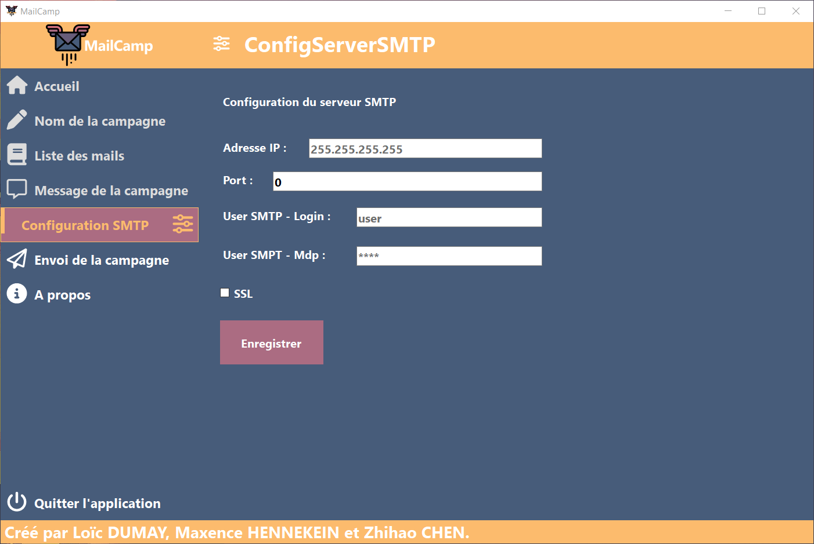

# Conception de l'application - V2

### Diagramme de cas d'utilisation.

### UI-UX Design modèle

#### Palette de couleur utilisée

Codes couleurs : 

`FCBB6D` - `D8737F` - `AB6C82` - `685D79` - `475C7A` 

#### Nouveau protoype d'interface

### Diagramme de flux

### Diagramme de classes

## 3 - Rendu de l'application

