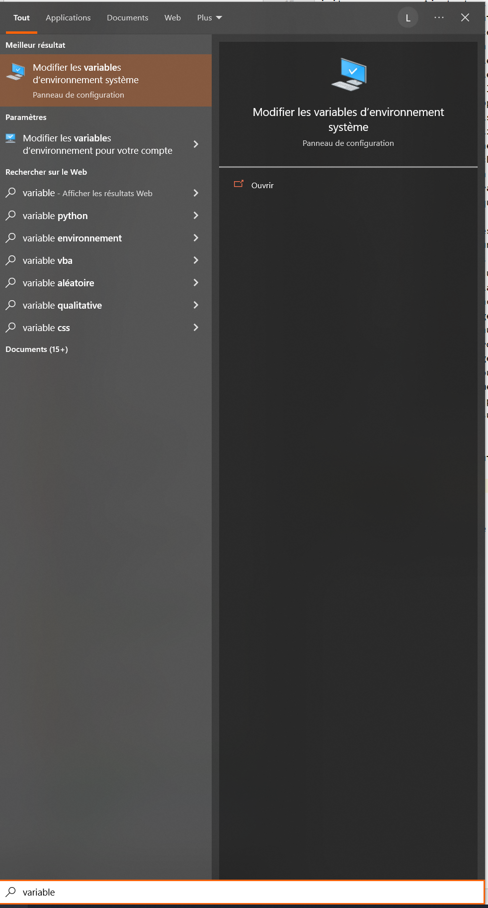
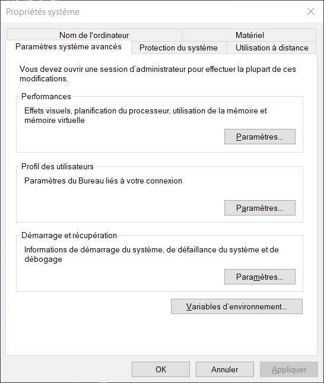
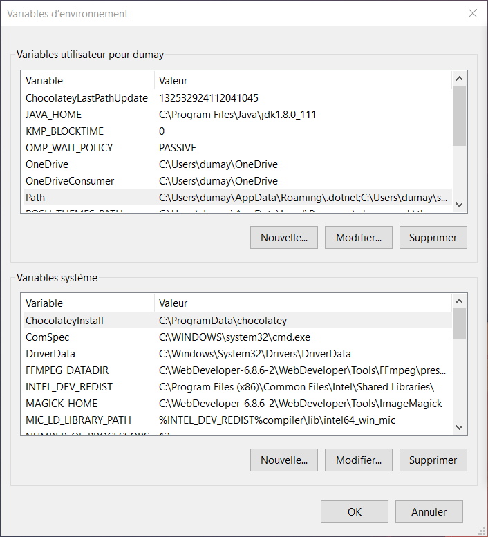
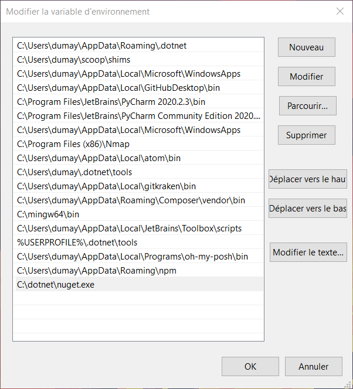

[Retour](../../)

# Installation de **Nuget**

Pour ce faire, il est nécessaire de télécharger le fichier d'installation de `dotnet-install`.

Celui-ci est disponible ici :
- Available NuGet Distribution Versions [https://www.nuget.org/downloads](https://www.nuget.org/downloads)

> **NB :** Si les liens ci-dessous sont indisponible, il faut aller sur la documentation de Nuget : [https://learn.microsoft.com/fr-fr/nuget/](https://learn.microsoft.com/fr-fr/nuget/)

Une fois télécharger, il est maintenant le temps de l'installer. 

Voici une suite de commande que je propose permettant de **préparer**, **télécharger** et **installer** `dotnet-install`.

```
cd /
mkdir dotnet
cd dotnet
Invoke-WebRequest -URI https://dist.nuget.org/win-x86-commandline/latest/nuget.exe -OutFile nuget.exe
```

Puis exécuter au moins une fois le fichier `.exe` de Nuget :

- soit, en double cliquant dessus depuis le dossier `dotnet` créé.
- soit, avec la commande ci-dessous :

```
.\nuget.exe
```

Voici le résultat obtenu.

```
NuGet Version : 6.4.0.123
utilisation : NuGet <command> [args] [options]
Tapez 'NuGet help <command>' pour obtenir de l'aide sur une commande spécifique.
Commandes disponibles :
 add               Ajoute le package donné à une source hiérarchique. Les sources HTTP ne sont pas prises en charge. Pour plus d'
                   informations, consultez https://docs.nuget.org/consume/command-line-reference#add-command.
 client-certs      Permet de gérer la liste des certificats clients situés dans les fichiers NuGet.config
 config            Obtient ou définit des valeurs de configuration NuGet.
 delete            Supprime un package du serveur.
 help (?)          Affiche des informations d'aide générales et des informations d'aide sur d'autres commandes.
 init              Ajoute tous les packages depuis <srcPackageSourcePath> vers le <destPackageSourcePath> hiérarchique. Les flux
                   HTTP ne sont pas pris en charge. Pour plus d'informations, consultez https://docs.nuget.org/consume/command-li
                   ne-reference#init-command.
 install           Installe un package à l'aide des sources spécifiées. Si aucune source n'est spécifiée, toutes les sources défi
                   nies dans le fichier de configuration NuGet seront utilisées. Si le fichier de configuration ne spécifie aucun
                   e source, le flux NuGet est utilisé par défaut.
 list              Affiche la liste des packages d'une source donnée. Si aucune source n'est spécifiée, toutes les sources défini
                   es dans %AppData%\NuGet\NuGet.config seront utilisées. Si NuGet.config ne spécifie aucune source, le flux NuGe
                   t est utilisé par défaut.
 locals            Efface ou liste les ressources NuGet locales telles que le cache des requêtes HTTP, le cache temporaire ou le
                   dossier général des packages de l'ordinateur.
 pack              Crée un package NuGet basé sur le fichier nuspec ou le projet spécifié.
 push              Effectue un push d'un package sur le serveur et le publie.
                   La configuration par défaut de NuGet est obtenue en chargeant %AppData%\NuGet\NuGet.config, puis en chargeant
                   n'importe quel fichier nuget.config ou .nuget\nuget.config à partir de la racine du lecteur et jusqu'au répert
                   oire actif.
 restore           Restaure les packages NuGet.
 search            Recherche une source donnée à l'aide de la chaîne de requête fournie. Si aucune source n'est spécifiée, toutes
                   les sources définies dans %AppData%\NuGet\NuGet.config seront utilisées.
 setApiKey         Enregistre une clé API pour une URL de serveur donnée. Lorsqu'aucune URL n'est fournie, la clé API est enregis
                   trée pour la galerie NuGet.
 sign              Signe un package NuGet avec le certificat spécifié.
 sources           Permet de gérer la liste des sources situées dans les fichiers NuGet.config.
 spec              Génère un nuspec pour un nouveau package. Si cette commande est exécutée dans le même dossier qu'un fichier pr
                   ojet (.csproj, .vbproj, .fsproj), elle crée un fichier nuspec avec jeton.
 trusted-signers   Permet de gérer la liste des signataires approuvés.
 update            Mettez à jour les packages vers les dernières versions disponibles. Cette commande met également à jour NuGet.
                   exe lui-même.
 verify            Vérifie un package NuGet signé.
Pour plus d'informations, consultez https://docs.nuget.org/docs/reference/command-line-reference
```

Maintenant, il faut aussi ajouté `nuget.exe` aux variables de l'environnement pour pouvoir l'utiliser les commandes de celui-ci.

Il faut rechercher `variable` dans la recherche du menu démarrer pour ouvrir **Modifier les variables d'environnement système**.



Cliquer sur **Variables d'environnement...**



Cliquer sur la varaible **PATH** dans les variables utilisateurs.



Ajouter maintenant cette ligne `C:\dotnet\nuget.exe` à la variable **PATH**.



Voilà, fermer toutes les fenêtres en cliquant sur chaque **OK** et la commande est prète maintenant.