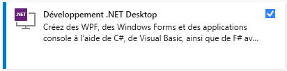
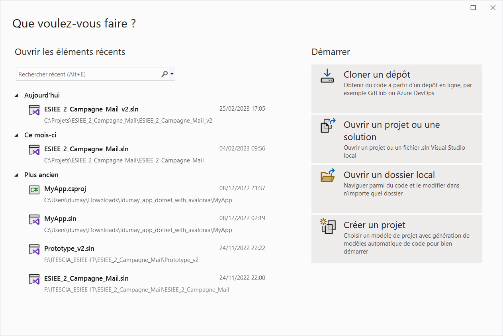
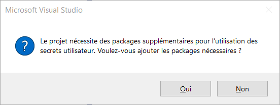
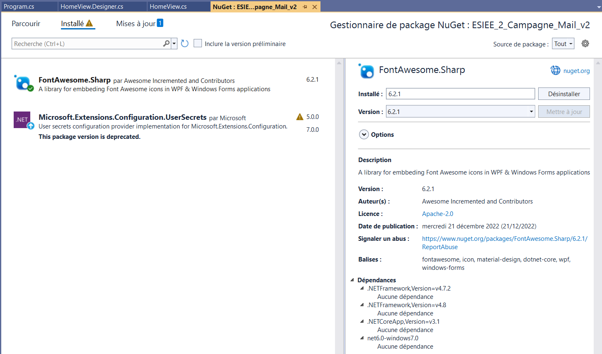
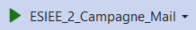

# ESIEE-IT - Campagne Mail

## 0 - Recherches Ldumay

- [HELP_RECHERCHES](HELP_RECHERCHES.md)

## 1 - Conception de l'application & Design

Au vu du fait que l'application est passé par divers reflexion, celle-ci à pu obtenir plusieurs conception d'évolution.

Vous les trouverez ci-dessous, ainsi que leurs archive de version.

### Conceptions

- [CONCEPT_v1](CONCEPT_v1.md)
- [CONCEPT_v2](CONCEPT_v2.md)

### Versions

- Version 1.0
  - [release v1.0](https://github.com/ldumay/esiee_2022_campagne_mail/releases/tag/v1.0)
  - [branche v1.0](https://github.com/ldumay/esiee_2022_campagne_mail/tree/v1.0)
- Version 2.0
  - [release v2.0](https://github.com/ldumay/esiee_2022_campagne_mail/releases/tag/v2.0)
  - [branche v2.0](https://github.com/ldumay/esiee_2022_campagne_mail/tree/v2.0)

Toutes les releases sont disponibles ici : [esiee_2022_campagne_mail/releases](https://github.com/ldumay/esiee_2022_campagne_mail/releases) 

## 2 - Pré-requis

Afin de pouvoir éditer ou débugger l'application, il est nécessaire d'avoir :

1. **Windows 10**
2. **.Net 6.0**
3. **Visual Studio - Version : Communauté**
    - Téléchargeable [ici](https://visualstudio.microsoft.com/fr/downloads/)
    - Pack à installer : Développement .Net Desktop
      - 
4. **.Net CLI**
    - Si besoin, voici un [guide d'installation de DotNet CLI](Install_DotNet_CLI.md)
5. **Nuget**
    - Si besoin, voici un [guide d'installation de Nuget](Install_Nuget.md)
6. **.Net CLI - Packages**
    - **FontAwesome.Sharp**
        - Si besoin, voici un [guide d'installation du package FontAwesome.Sharp](Install_DotNet_CLI_FontAwesome_Sharp.md)

## 3 - Chargé les paquets du projet

Tout d'abord, **descendre** dans le dossier du projet avec **PowerShell**.

```
Structure du dossier
Le numéro de série du volume est 36A6-D39A
C:
└───ESIEE_2_Campagne_Mail/
    ├───.vs
    ├───ESIEE_2_Campagne_Mail/ <== IL_FAUT_ALLER_A_CE_NIVEAU
    │    ├───bin/
    │    ├───obj/
    │    ├───Properties/
    │    ├───views/
    │    ├───ESIEE_2_Campagne_Mail.csproj
    │    ├───ESIEE_2_Campagne_Mail.csproj.user
    │    └───Program.cs
    └───ESIEE_2_Campagne_Mail.slnn
```

Puis **recharger** tous les paquets nécessaire avec la commande ci-dessous.

```
donet restore
```

## 4 - Ouvrir le projet

Lancer **Visual Studio** et ouvrer le projet via le fichier de solution d'extension **.sln**.



Vérifier l'état des paquets avec une clique droit sur le projet pour ouvrir le gestionnaire de paquets de **Nuget**.


Il est possible que ce message apparait si les paquets ont mal été chargé, mais **Visual Studio** devrait aussi pouvoir les rechargés (si non, rechargé les paquets via la commande plus haut).



Une fois le gestionnaire de paquets de **Nuget**, il est possible de gérer les paquets du projet.



## 5 - Lancer le projet

Une fois projet chargé dans Visual Studio, vous pouvez le lancer.


