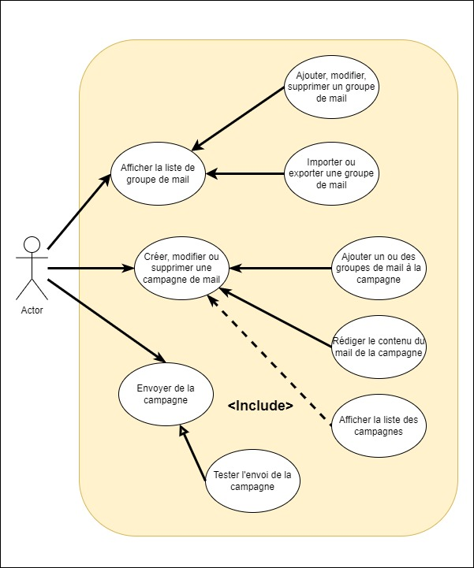
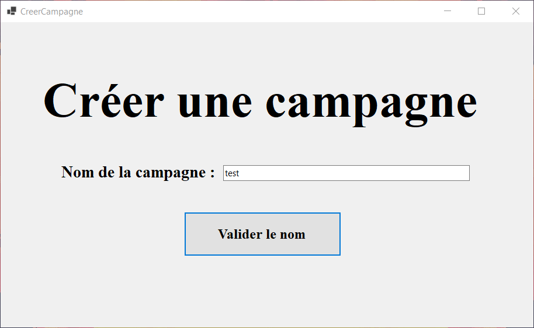
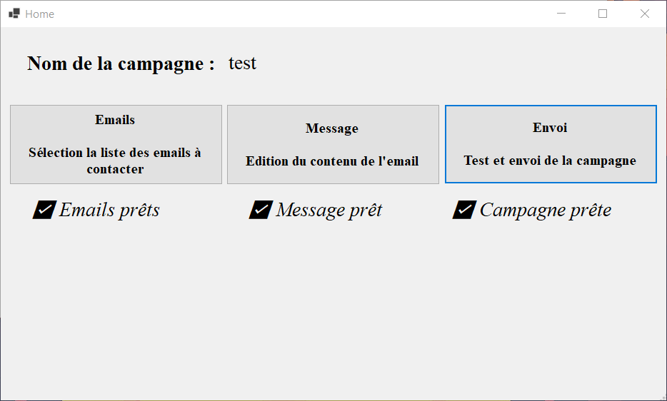
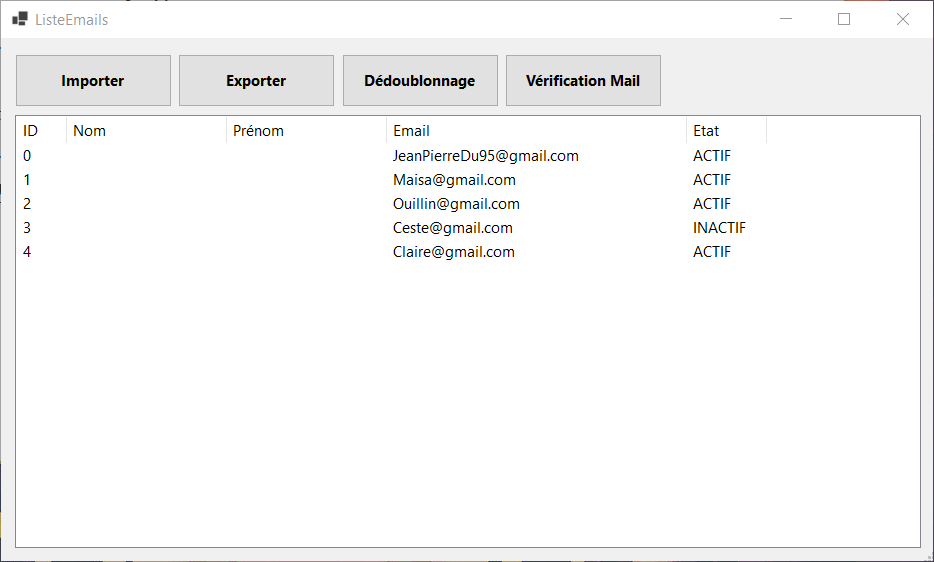
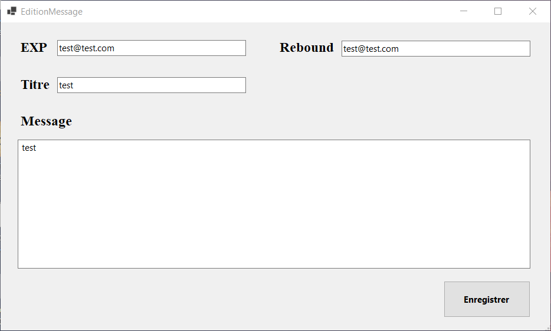
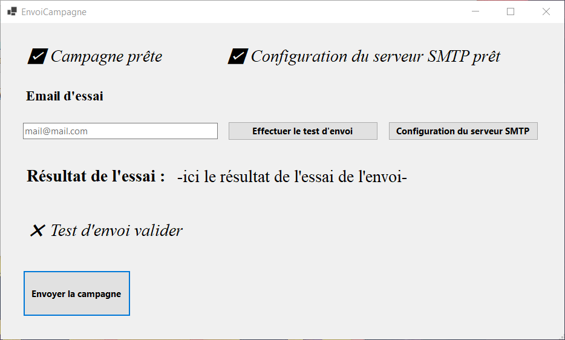
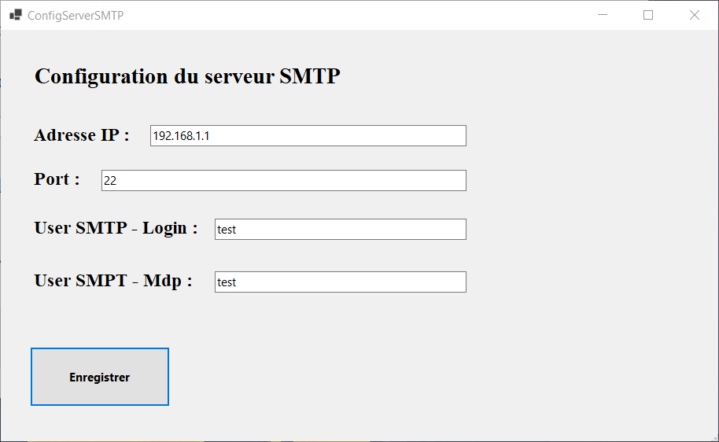

# ESIEE_2_Campagne_Mail

## 0 - Recherches Ldumay

[HELP_RECHERCHES](HELP_RECHERCHES.md)

## 1 - Requis

Afin de pouvoir éditer ou débugger l'application, il est nécessaire d'avoir :

- **Windows 10**
- **.Net 6.0**
- **Visual Studio - Version : Communauté**
    - Téléchageable [ici](https://visualstudio.microsoft.com/fr/downloads/)
    - Pack à installer : Développement .et Desktop
    

## 2 - Conception de l'application

### Diagramme de cas d'utilisation.

### UI-UX Design modèle

### Diagramme de flux

### Diagramme de classes

## 3 - Rendu de l'application

